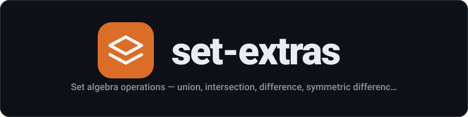

<div align="center">
  
</div>

<p align="center"><strong>Set algebra operations — union, intersection, difference, symmetric difference, subset, superset</strong></p>

<p align="center">
  <a href="LICENSE"></a>
  <a href="https://www.npmjs.com/package/set-extras"></a>
  
</p>

---
## Install

```sh
npm install set-extras
```

## Usage

```js
import {union, intersection, difference, symmetricDifference, isSubset, isSuperset} from 'set-extras';

union(new Set([1, 2]), new Set([2, 3]));
//=> Set {1, 2, 3}

intersection(new Set([1, 2, 3]), new Set([2, 3, 4]));
//=> Set {2, 3}

difference(new Set([1, 2, 3]), new Set([2, 3, 4]));
//=> Set {1}

symmetricDifference(new Set([1, 2, 3]), new Set([2, 3, 4]));
//=> Set {1, 4}

isSubset(new Set([1, 2]), new Set([1, 2, 3]));
//=> true

isSuperset(new Set([1, 2, 3]), new Set([1, 2]));
//=> true
```

## API

### union(setA, setB)

Returns a new Set with all elements from both sets.

### intersection(setA, setB)

Returns a new Set with elements present in both sets.

### difference(setA, setB)

Returns a new Set with elements in `setA` but not in `setB`.

### symmetricDifference(setA, setB)

Returns a new Set with elements in either set but not both.

### isSubset(setA, setB)

Returns `true` if all elements of `setA` are in `setB`.

### isSuperset(setA, setB)

Returns `true` if all elements of `setB` are in `setA`.

## Related

- [map-extras](https://github.com/mstuart/map-extras) - Utility functions for JavaScript Map

## License

MIT
